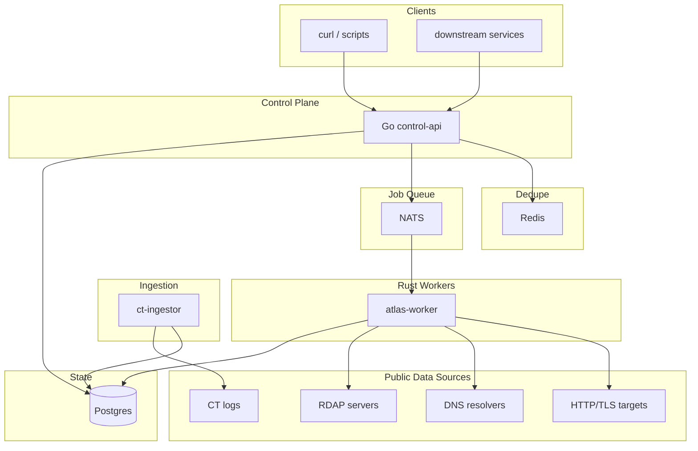
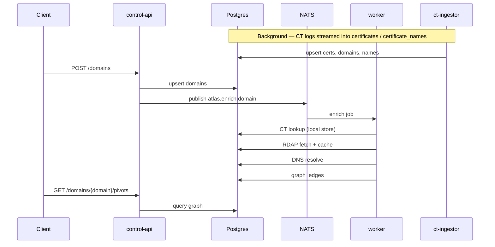
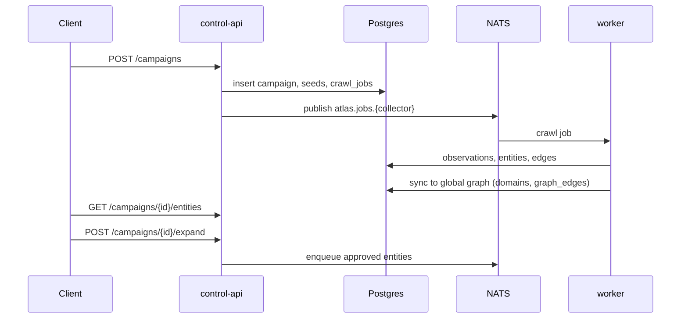
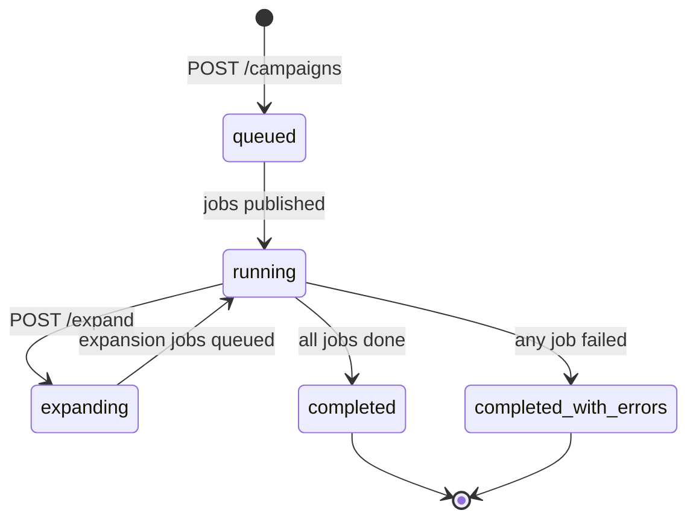

# Atlas Architecture

Component overview and operational flows for the default docker-compose stack.

## Overview

Atlas is a **domain intelligence graph** service. It ingests public Certificate Transparency logs, RDAP registration data, and DNS records; normalises them into Postgres; and exposes pivot-friendly APIs for external surface discovery.

| Component | Role |
|-----------|------|
| **control-api** | REST API — campaigns, domain intelligence, pivots, CT config |
| **atlas-worker** | Async collectors (DNS, HTTP, TLS, CT local lookup, RDAP) |
| **ct-ingestor** | Continuous CT log ingestion; TLD-targeted backfill |
| **NATS** | Job queue (`atlas.jobs.*`, `atlas.enrich.domain`) |
| **Postgres** | Intelligence graph + campaign orchestration state |
| **Redis** | Hot dedupe for campaign job enqueue |

## Intelligence flow

## Campaign flow

Campaigns add **controlled expansion** — discoveries become suggestions until explicitly approved.

## Campaign lifecycle

## Data layers

| Layer | Tables | Scope |
|-------|--------|-------|
| **Intelligence graph** | `domains`, `certificates`, `rdap_records`, `dns_records`, `graph_edges`, … | Global, cross-campaign |
| **Campaign state** | `campaigns`, `entities`, `edges`, `crawl_jobs`, `observations` | Per discovery run |

Campaign collector output is **mirrored** into the intelligence graph so pivots work across both direct seeding and campaign discoveries.

## NATS subjects

| Subject | Publisher | Consumer |
|---------|-----------|----------|
| `atlas.jobs.dns` | control-api | worker |
| `atlas.jobs.http` | control-api | worker |
| `atlas.jobs.tls` | control-api | worker |
| `atlas.jobs.ct` | control-api | worker |
| `atlas.jobs.rdap` | control-api | worker |
| `atlas.enrich.domain` | control-api | worker |

## Related docs

| Guide | Description |
|-------|-------------|
| [API guide](./api.md) | Endpoints, request/response shapes |
| [Data model](./data-model.md) | Intelligence schema and relationships |
| [Collectors](./collectors.md) | DNS, HTTP, TLS, CT, RDAP collectors |
| [CT ingestor](./ct-ingestor.md) | Log ingestion, backfill, TLD filtering |
| [Pivots](./pivots.md) | Reverse intelligence via graph pivots |
| [Operations](./operations.md) | Deployment, env vars, tuning |
| [Metrics](./metrics.md) | Operational metrics and Prometheus |
| [OpenAPI spec](./openapi.yaml) | Machine-readable API schema |
