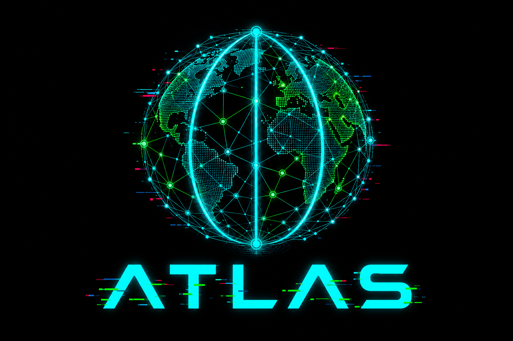

[](.github/images/logo.png)

# Atlas

[](https://go.dev/)
[](https://www.rust-lang.org/)
[](docker-compose.yml)

> **Disclaimer:** Atlas is for authorised security research and asset discovery only. Only investigate domains and infrastructure you own or have explicit written permission to analyse. The authors are not responsible for misuse.

[Performance](#performance) · [Quick start](#quick-start) · [Intelligence API](#intelligence-api) · [Documentation](#documentation) · [Architecture](.github/docs/architecture.md)

External surface discovery and domain intelligence graph.

Atlas ingests public Certificate Transparency logs, RDAP, and DNS directly — no crt.sh, no third-party reverse WHOIS APIs — and builds a searchable graph you can pivot across safely.

## Documentation

| Guide | Description |
|-------|-------------|
| [Architecture](.github/docs/architecture.md) | Components, flows, campaign lifecycle |
| [API guide](.github/docs/api.md) | Endpoints, request/response shapes |
| [Data model](.github/docs/data-model.md) | Intelligence schema and relationships |
| [Collectors](.github/docs/collectors.md) | DNS, HTTP, TLS, CT, RDAP collectors |
| [CT ingestor](.github/docs/ct-ingestor.md) | Log ingestion, backfill, TLD filtering |
| [Pivots](.github/docs/pivots.md) | Reverse intelligence via graph pivots |
| [Operations](.github/docs/operations.md) | Deployment, env vars, tuning |
| [Metrics](.github/docs/metrics.md) | `/metrics` and Prometheus scraping |
| [Performance](.github/docs/performance.md) | Benchmarks and tuning |
| [OpenAPI spec](.github/docs/openapi.yaml) | Machine-readable API schema |

## Quick start

```bash
docker compose up --build
```

Control API: **http://localhost:8090**

### Seed a domain

```bash
curl -X POST http://localhost:8090/domains \
  -H "Content-Type: application/json" \
  -d '{"domains": ["example.com"], "collectors": ["ct", "rdap", "dns"]}'
```

### Query intelligence

```bash
curl http://localhost:8090/domains/example.com/pivots
curl http://localhost:8090/pivots/nameserver/ns1.example.net
```

### Start CT backfill

```bash
curl -X POST http://localhost:8090/ct/backfill \
  -H "Content-Type: application/json" \
  -d '{"target_tlds": ["com", "io", "co.uk"], "include_readonly": true}'
```

## Intelligence API

| Method | Path | Description |
|--------|------|-------------|
| `POST` | `/domains` | Seed domains + queue enrichment |
| `GET` | `/domains/{domain}` | Domain record + graph edges |
| `GET` | `/domains/{domain}/subdomains` | CT-discovered subdomains |
| `GET` | `/domains/{domain}/pivots` | Pivot artifact summary |
| `GET` | `/pivots/{type}/{value}` | Pivot outward (NS, cert, MX, …) |
| `GET` | `/ct/status` | CT ingestion progress |
| `GET` | `/metrics` | Operational metrics (JSON) |
| `GET` | `/metrics/prometheus` | Prometheus scrape target |

See the [API guide](.github/docs/api.md) for campaigns, RDAP, DNS, and full pivot reference.

## Architecture

| Component | Role |
|-----------|------|
| **control-api** (Go) | REST API, campaigns, domain intelligence |
| **worker** (Rust) | DNS, HTTP, TLS, CT, RDAP collectors |
| **ct-ingestor** (Rust) | Direct CT log ingestion |
| **NATS** | Job queue |
| **Postgres** | Intelligence graph + campaign state |
| **Redis** | Job dedupe cache |

## Local development

```bash
cd control && go run .
cd worker && cargo run --bin atlas-worker
cd worker && cargo run --bin atlas-ct-ingestor
```

## Testing

```bash
# Go unit tests
cd control && go test ./...

# Rust unit tests
cd worker && cargo test --bin atlas-worker --bin atlas-ct-ingestor

# End-to-end (requires running stack)
docker compose up -d --build
bash tests/e2e.sh

# Benchmark: queue + worker completion (default 500 jobs, CT collector)
bash tests/bench.sh

# Full sweep: 100 → 5,000 jobs
bash tests/bench-sweep.sh
```

Set `API=http://control-api:8090` when running scripts from inside the compose network. Override `RUNS`, `COLLECTORS`, and `TIMEOUT_SEC` as needed. See the [performance guide](.github/docs/performance.md).

CI runs unit tests, release builds, and `tests/e2e.sh` against docker-compose on every push/PR (see `.github/workflows/ci.yml`).

## Performance

Campaign benchmark: one `POST /campaigns` with `N` seeds and the `ct` collector (local Postgres lookup). Single worker, `WORKER_CONCURRENCY=20`, Docker Desktop on Windows 11.

| Jobs | Queue (ms) | Worker (ms) | Total (ms) | Queue rate | Worker rate | Total rate |
|------|------------|-------------|------------|------------|-------------|------------|
| 100 | 1,750 | 29 | 1,811 | 57/s | 3,448/s | 55/s |
| 500 | 8,507 | 24 | 8,562 | 59/s | 20,833/s | 58/s |
| 1,000 | 17,202 | 25 | 17,256 | 58/s | 40,000/s | 58/s |
| 5,000 | 88,356 | 34 | 88,428 | 57/s | 147,059/s | 57/s |

Workers process jobs while the campaign is still being queued, so **total rate** (~57 jobs/sec here) reflects the real bottleneck: sequential campaign creation. See the [performance guide](.github/docs/performance.md) for tuning, collector comparison, and how to re-run `tests/bench-sweep.sh`.

Operational counters (CT backfill progress, job backlog, graph size) live at `GET /metrics` — see the [metrics guide](.github/docs/metrics.md).